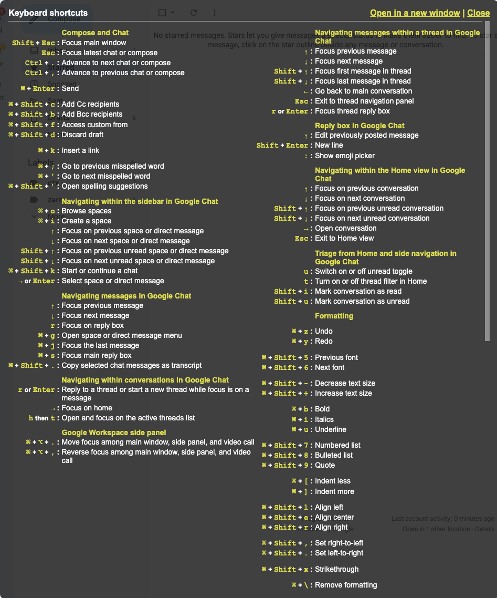
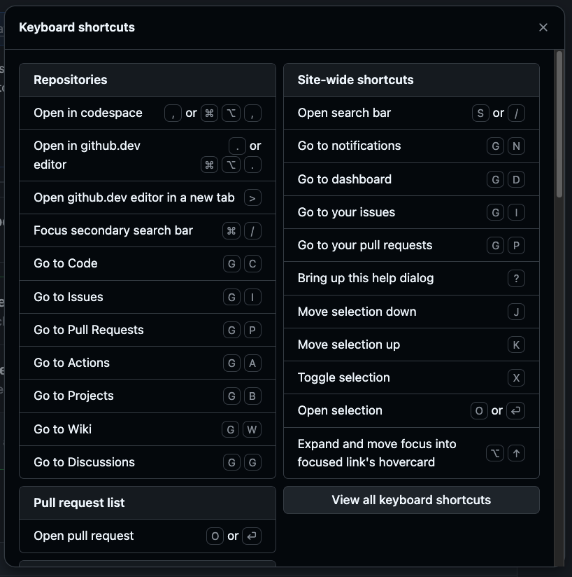
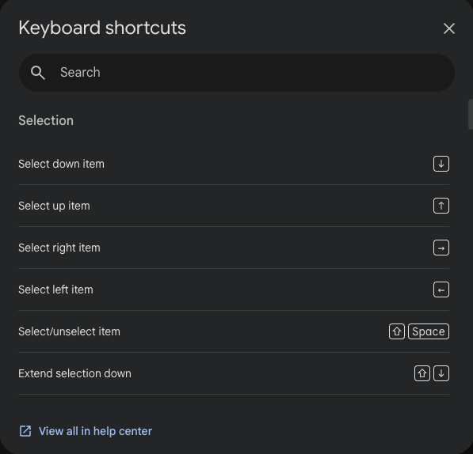

# use-kbd

[](https://www.npmjs.com/package/use-kbd)

Keyboard-navigation and -control for the web: omnibars, editable hotkeys, search, modes/sequences.

Documentation & Demos: [kbd.rbw.sh]

## Quick Start

```bash
npm install use-kbd  # or: pnpm add use-kbd
```

or install latest GitHub [`dist` branch] commit width [`pds`]:

```bash
pds init runsascoded/use-kbd
```

[`dist` branch]: ./tree/dist
[`pds`]: https://github.com/runsascoded/pnpm-dep-source

```tsx
import { HotkeysProvider, ShortcutsModal, Omnibar, LookupModal, SequenceModal, useAction } from 'use-kbd'
import 'use-kbd/styles.css'

function App() {
  return (
    <HotkeysProvider>
      <Dashboard />
      <ShortcutsModal />  {/* "?" modal: view/edit key-bindings */}
      <Omnibar />         {/* "⌘K" omnibar: search and select actions */}
      <LookupModal />     {/* "⌘⇧K": look up actions by key-binding */}
      <SequenceModal />   {/* Inline display for key-sequences in progress */}
    </HotkeysProvider>
  )
}

function Dashboard() {
  const { save } = useDocument()  // Function to expose via hotkeys / omnibar

  // Wrap function as "action", with keybinding(s) and omnibar keywords
  useAction('doc:save', {
    label: 'Save document',
    group: 'Document',
    defaultBindings: ['meta+s'],
    handler: save,
  })

  return <Editor />
}
```

### Basic steps

1. **Drop-in UI components**:
   - `ShortcutsModal`: view/edit key-bindings
   - `Omnibar`: search and select actions
   - `LookupModal`: look up actions by key-binding
   - `SequenceModal`: autocomplete multi-key sequences
2. **Register functions as "actions"** with `useAction`
3. **Easy theming** with CSS variables

## Motivation / Examples

### Usage in the wild

- [ctbk.dev] ([GitHub][ctbk-gh] · [usage][ctbk-usage] · [diff][ctbk-diff]) — Citi Bike trip data explorer
- [awair.runsascoded.com] ([GitHub][awair-gh] · [usage][awair-usage] · [diff][awair-diff]) — Awair air quality dashboard
- [jct.rbw.sh] ([GitHub][jct-gh] · [usage][jct-usage] · [diff][jct-diff]) — Jersey City 3D tax map
- [voro.rbw.sh] ([GitHub][voro-gh] · [usage][voro-usage]) — Image Voronoi generator

[kbd.rbw.sh]: https://kbd.rbw.sh
[ctbk.dev]: https://ctbk.dev
[ctbk-gh]: https://github.com/hudcostreets/ctbk.dev
[ctbk-diff]: https://github.com/hudcostreets/ctbk.dev/compare/pre-use-kbd...use-kbd-demo
[ctbk-usage]: https://github.com/search?q=repo%3Ahudcostreets%2Fctbk.dev+use-kbd&type=code
[awair.runsascoded.com]: https://awair.runsascoded.com
[awair-gh]: https://github.com/runsascoded/awair
[awair-diff]: https://github.com/runsascoded/awair/compare/pre-use-kbd...use-kbd-demo
[awair-usage]: https://github.com/search?q=repo%3Arunsascoded%2Fawair+use-kbd&type=code
[jct.rbw.sh]: https://jct.rbw.sh
[jct-gh]: https://github.com/neighbor-ryan/jc-taxes
[jct-diff]: https://github.com/neighbor-ryan/jc-taxes/compare/pre-use-kbd...use-kbd-demo
[jct-usage]: https://github.com/search?q=repo%3Arunsascoded%2Fjc-taxes+use-kbd&type=code
[voro.rbw.sh]: https://voro.rbw.sh
[voro-gh]: https://github.com/runsascoded/ImageVoronoi
[voro-usage]: https://github.com/search?q=repo%3Arunsascoded%2FImageVoronoi+use-kbd&type=code

### Comparison

Most web apps ship a static, read-only shortcuts list (at most). use-kbd provides a full keyboard UX layer:

<table>
<tr>
<td><a href="img/gmail-kbd.png"></a></td>
<td><a href="img/github-kbd.png"></a></td>
<td><a href="img/drive-kbd.png"></a></td>
</tr>
</table>

| Feature |  Gmail |  GitHub |  Drive |  use-kbd |
|---|---|---|---|---|
| View shortcuts | 📄 flat | 📊 grouped | 📊 grouped | ✅ grouped, collapsible |
| Edit bindings | ❌ | ❌ | ❌ | ✅ click-to-edit |
| Search / filter | ❌ | ❌ | 🔍 filter only | ✅ fuzzy omnibar |
| Command palette | ❌ | ⚡ separate | ❌ | ✅ integrated |
| Sequences | ✅ `g i` | ✅ `G` `C` | ❌ | ✅ + live preview |
| Conflict detection | ❌ | ❌ | ❌ | ✅ real-time |
| Import / Export | ❌ | ❌ | ❌ | ✅ JSON |
| Modes | ❌ | ❌ | ❌ | ✅ editable groups |
| Arrow groups | ❌ | ❌ | ❌ | ✅ compact rows |
| Action pairs / triplets | ❌ | ❌ | ❌ | ✅ collapsed with `/` |
| Digit placeholders | ❌ | ❌ | ❌ | ✅ `\d` `\d+` `\f` |
| Multiple bindings | ➖ some | ➖ "or" | ➖ some | ✅ click `+` to add |

GitHub's command palette (`⌘K`) is conceptually similar to use-kbd's omnibar, but disconnected from the shortcuts modal. Drive has a search bar (rare!), but it's filter-only and read-only. Gmail requires a Settings toggle before shortcuts work at all.

### Inspiration

- macOS and GDrive menu search
- [Superhuman] omnibar
- [Vimium] keyboard-driven browsing
- Android searchable settings

## Core Concepts

### Actions

Register any function with `useAction`:

```tsx
useAction('view:toggle-sidebar', {
  label: 'Toggle sidebar',
  description: 'Show or hide the sidebar panel',  // Tooltip in ShortcutsModal
  group: 'View',
  defaultBindings: ['meta+b', 'meta+\\'],
  keywords: ['panel', 'navigation'],
  handler: () => setSidebarOpen(prev => !prev),
})
```

Actions automatically unregister when the component unmounts—no cleanup needed.

Conditionally disable actions with `enabled`:

```tsx
useAction('doc:save', {
  label: 'Save',
  defaultBindings: ['meta+s'],
  enabled: hasUnsavedChanges,  // Action hidden when false
  handler: save,
})
```

Protect essential bindings from removal with `protected`:

```tsx
useAction('app:shortcuts', {
  label: 'Show shortcuts',
  defaultBindings: ['?'],
  protected: true,  // Users can add bindings, but can't remove this one
  handler: () => openShortcutsModal(),
})
```

Control display order within a group with `sortOrder` (lower values appear first; default `0`, ties broken by registration order):

```tsx
useAction('app:shortcuts', {
  label: 'Show shortcuts',
  sortOrder: 0,   // Appears first
  // ...
})
useAction('app:omnibar', {
  label: 'Command palette',
  sortOrder: 1,   // Appears second
  // ...
})
```

### Action Pairs

Collapse two inverse actions into a single compact row in `ShortcutsModal` with `useActionPair`:

```tsx
import { useActionPair } from 'use-kbd'

useActionPair('view:zoom', {
  label: 'Zoom in / out',
  group: 'View',
  actions: [
    { defaultBindings: ['='], handler: () => zoomIn() },
    { defaultBindings: ['-'], handler: () => zoomOut() },
  ],
})
```

Creates `view:zoom-a` and `view:zoom-b` actions, displayed as one row: `Zoom in / out    [=] / [-]`

### Action Triplets

Same pattern for three related actions with `useActionTriplet`:

```tsx
import { useActionTriplet } from 'use-kbd'

useActionTriplet('view:slice', {
  label: 'Slice along X / Y / Z',
  group: 'View',
  actions: [
    { defaultBindings: ['x'], handler: () => sliceX() },
    { defaultBindings: ['y'], handler: () => sliceY() },
    { defaultBindings: ['z'], handler: () => sliceZ() },
  ],
})
```

Creates `view:slice-a`, `-b`, `-c` actions, displayed as: `Slice along X / Y / Z    [X] / [Y] / [Z]`

### Sequences

Multi-key sequences like Vim's `g g` (go to top) are supported:

```tsx
useAction('nav:top', {
  label: 'Go to top',
  defaultBindings: ['g g'],  // Press g, then g again
  handler: () => scrollToTop(),
})
```

The `SequenceModal` shows available completions while typing a sequence.

### Digit Placeholders

Bindings can include digit placeholders for numeric arguments. Use `\d+` for one or more digits:

```tsx
useAction('nav:down-n', {
  label: 'Down N rows',
  defaultBindings: ['\\d+ j'],  // e.g., "5 j" moves down 5 rows
  handler: (e, captures) => {
    const n = captures?.[0] ?? 1
    moveDown(n)
  },
})
```

Use `\f` for float placeholders (integers or decimals):

```tsx
useAction('transform:scale', {
  label: 'Scale values by N',
  defaultBindings: ['o \\f'],  // e.g., "o 1.5" scales by 1.5
  handler: (e, captures) => {
    const factor = captures?.[0] ?? 1
    scaleBy(factor)
  },
})
```

When a user selects a placeholder action from the Omnibar or LookupModal without providing a number, a parameter entry prompt appears to collect the value.

### Modes

Modes are sticky shortcut scopes—enter a mode via a key sequence, then use short single-key bindings that only exist while the mode is active. Escape exits the mode.

```tsx
import { useMode, useAction, ModeIndicator } from 'use-kbd'

function Viewport() {
  const mode = useMode('viewport', {
    label: 'Pan & Zoom',
    color: '#4fc3f7',
    defaultBindings: ['g v'],
  })

  useAction('viewport:pan-left', {
    label: 'Pan left',
    mode: 'viewport',                // Only active when mode is active
    defaultBindings: ['h', 'left'],
    handler: () => panLeft(),
  })

  useAction('viewport:zoom-in', {
    label: 'Zoom in',
    mode: 'viewport',
    defaultBindings: ['='],
    handler: () => zoomIn(),
  })

  return <ModeIndicator position="bottom-left" />
}
```

**Key behaviors:**

- **Global passthrough** – Keys not bound in the mode pass through to global bindings (default: `passthrough: true`)
- **Mode shadows global** – If a mode action and a global action share a key, the mode action wins while active
- **Toggle** – The activation sequence also deactivates the mode (default: `toggle: true`)
- **Escape exits** – Pressing Escape deactivates the mode (default: `escapeExits: true`)
- **Omnibar integration** – Mode-scoped actions appear in the Omnibar with a mode badge; executing one auto-activates the mode
- **ShortcutsModal** – Mode actions appear in their own group with a colored left border

### Arrow Groups

Register four directional arrow-key actions as a compact group with `useArrowGroup`. They display as a single row in `ShortcutsModal`, and the modifier prefix can be edited as a unit (hold modifiers + press Enter or an arrow key to confirm):

```tsx
import { useArrowGroup } from 'use-kbd'

useArrowGroup('camera:pan', {
  label: 'Pan',
  group: 'Camera',
  mode: 'viewport',
  defaultModifiers: ['shift'],
  handlers: {
    left:  () => pan(-1, 0),
    right: () => pan(1, 0),
    up:    () => pan(0, -1),
    down:  () => pan(0, 1),
  },
  extraBindings: {                  // Optional non-arrow aliases
    left: ['h'], right: ['l'],
    up: ['k'], down: ['j'],
  },
})
```

This creates four actions (`camera:pan-left`, …, `camera:pan-down`), each bound to `shift+arrow{dir}` plus any extras. In `ShortcutsModal` they collapse into one row showing `⇧ + ← → ↑ ↓`.

### Key Aliases

For convenience, common key names have shorter aliases:

| Alias | Key |
|-------|-----|
| `left`, `right`, `up`, `down` | Arrow keys |
| `esc` | `escape` |
| `del` | `delete` |
| `return` | `enter` |
| `pgup`, `pgdn` | `pageup`, `pagedown` |

```tsx
useAction('nav:prev', {
  label: 'Previous item',
  defaultBindings: ['left', 'h'],  // 'left' = 'arrowleft'
  handler: () => selectPrev(),
})
```

### User Customization

Users can edit bindings in the `ShortcutsModal`. Changes persist to localStorage using the `storageKey` you provide.

#### Export/Import Bindings

Users can export their customized bindings as JSON and import them in another browser or device:

```tsx
<ShortcutsModal editable />  // Shows Export/Import buttons
```

The exported JSON contains:
- `version` – Library version for compatibility
- `overrides` – Custom key→action bindings
- `removedDefaults` – Default bindings the user removed

Programmatic access via the registry:

```tsx
const { registry } = useHotkeysContext()

// Export current customizations
const data = registry.exportBindings()

// Import (replaces current customizations)
registry.importBindings(data)
```

Customize the footer with `footerContent`:

```tsx
<ShortcutsModal
  editable
  footerContent={({ exportBindings, importBindings, resetBindings }) => (
    <div className="my-custom-footer">
      <button onClick={exportBindings}>Download</button>
      <button onClick={importBindings}>Upload</button>
    </div>
  )}
/>
```

Pass `footerContent={null}` to hide the footer entirely.

## Components

### `<HotkeysProvider>`

Wrap your app to enable the hotkeys system:

```tsx
<HotkeysProvider config={{
  storageKey: 'use-kbd',      // localStorage key for user overrides (default)
  sequenceTimeout: Infinity,  // ms before sequence times out (default: no timeout)
  disableConflicts: false,    // Disable keys with multiple actions (default: false)
  enableOnTouch: false,       // Enable hotkeys on touch devices (default: false)
  builtinGroup: 'Meta',       // Group name for built-in actions (default: 'Meta')
}}>
  {children}
</HotkeysProvider>
```

Note: Modal/omnibar trigger bindings are configured via component props (`defaultBinding`), not provider config.

### `<ShortcutsModal>`

Displays all registered actions grouped by category. Users can click bindings to edit them on desktop.

```tsx
<ShortcutsModal
  editable                    // Enable editing, Export/Import buttons
  groups={{ nav: 'Navigation', edit: 'Editing' }}
  hint="Click any shortcut to customize"
/>
```

### `<Omnibar>`

Command palette for searching and executing actions:

```tsx
<Omnibar
  placeholder="Type a command..."
  maxResults={10}
/>
```

### `<LookupModal>`

Browse and filter shortcuts by typing key sequences. Press `⌘⇧K` (default) to open. Supports parameter entry for actions with [digit placeholders](#digit-placeholders)—type digits before selecting an action to use them as the value.

```tsx
<LookupModal defaultBinding="meta+shift+k" />
```

Open programmatically with pre-filled keys via context:

```tsx
const { openLookup } = useHotkeysContext()

// Open with "g" already typed (shows all "g ..." sequences)
openLookup([{ key: 'g', modifiers: { ctrl: false, alt: false, shift: false, meta: false } }])
```

### `<SequenceModal>`

Shows pending keys and available completions during sequence input. No props needed—it reads from context.

```tsx
<SequenceModal />
```

### `<ModeIndicator>`

Fixed-position pill showing the active mode. Automatically hides when no mode is active.

```tsx
<ModeIndicator position="bottom-right" />  {/* or: bottom-left, top-right, top-left */}
```

### `<SpeedDial>`

Floating action button (FAB) with expandable secondary actions. Opens the omnibar by default, with optional extra actions.

```tsx
<SpeedDial
  actions={[
    { key: 'github', label: 'GitHub', icon: <GitHubIcon />, href: 'https://github.com/...' },
  ]}
/>
```

## Styling

Import the default styles:

```tsx
import 'use-kbd/styles.css'
```

Customize with CSS variables:

```css
.kbd-modal,
.kbd-omnibar,
.kbd-sequence {
  --kbd-bg: #1f2937;
  --kbd-text: #f3f4f6;
  --kbd-border: #4b5563;
  --kbd-accent: #3b82f6;
  --kbd-kbd-bg: #374151;
}
```

Dark mode is automatically applied via `[data-theme="dark"]` or `.dark` selectors.

## Mobile Support

While keyboard shortcuts are primarily a desktop feature, use-kbd provides solid mobile UX out of the box. **[Try the demos on your phone →][kbd.rbw.sh]**

**What works on mobile:**

- **Omnibar search** – Tap the search icon or `⌘K` badge to open, then search and execute actions
- **LookupModal** – Browse shortcuts by typing on the virtual keyboard
- **ShortcutsModal** – View all available shortcuts (editing disabled since there's no physical keyboard)
- **Back button/swipe** – Native gesture closes modals
- **Responsive layouts** – All components adapt to small screens

**Demo-specific features:**

- [Table demo][table-demo] – Tap search icon in the floating controls to open omnibar
- [Canvas demo][canvas-demo] – Touch-to-draw support alongside keyboard shortcuts

[table-demo]: https://kbd.rbw.sh/table
[canvas-demo]: https://kbd.rbw.sh/canvas

For apps that want keyboard shortcuts on desktop but still need the omnibar/search on mobile, this covers the common case without extra configuration.

## Patterns

### ActionLink

Make navigation links discoverable in the omnibar by registering them as actions. Here's a reference implementation for react-router:

```tsx
import { useEffect, useRef } from 'react'
import { Link, useLocation, useNavigate } from 'react-router-dom'
import { useMaybeHotkeysContext } from 'use-kbd'

interface ActionLinkProps {
  to: string
  label?: string
  group?: string
  keywords?: string[]
  defaultBinding?: string
  children: React.ReactNode
}

export function ActionLink({
  to,
  label,
  group = 'Navigation',
  keywords,
  defaultBinding,
  children,
}: ActionLinkProps) {
  const ctx = useMaybeHotkeysContext()
  const navigate = useNavigate()
  const location = useLocation()

  const isActive = location.pathname === to
  const effectiveLabel = label ?? (typeof children === 'string' ? children : to)
  const actionId = `nav:${to}`

  // Use ref to avoid re-registration on navigate change
  const navigateRef = useRef(navigate)
  navigateRef.current = navigate

  useEffect(() => {
    if (!ctx?.registry) return

    ctx.registry.register(actionId, {
      label: effectiveLabel,
      group,
      keywords,
      defaultBindings: defaultBinding ? [defaultBinding] : [],
      handler: () => navigateRef.current(to),
      enabled: !isActive,  // Hide from omnibar when on current page
    })

    return () => ctx.registry.unregister(actionId)
  }, [ctx?.registry, actionId, effectiveLabel, group, keywords, defaultBinding, isActive, to])

  return <Link to={to}>{children}</Link>
}
```

Usage:
```tsx
<ActionLink to="/docs" keywords={['help', 'guide']}>Documentation</ActionLink>
<ActionLink to="/settings" defaultBinding="g s">Settings</ActionLink>
```

Adapt for Next.js, TanStack Router, or other routers by swapping the router hooks.

## Low-Level Hooks

For advanced use cases, the underlying hooks are also exported:

### `useHotkeys(keymap, handlers, options?)`

Register shortcuts directly without the provider:

```tsx
useHotkeys(
  { 't': 'setTemp', 'meta+s': 'save' },
  { setTemp: () => setMetric('temp'), save: handleSave }
)
```

### `useRecordHotkey(options?)`

Capture key combinations from user input:

```tsx
const { isRecording, startRecording, display } = useRecordHotkey({
  onCapture: (sequence, display) => saveBinding(display.id),
})
```

### `useParamEntry(options)`

Manage parameter entry state for actions with [digit placeholders](#digit-placeholders). Used internally by `Omnibar` and `LookupModal`; useful for custom UIs:

```tsx
const paramEntry = useParamEntry({
  onSubmit: (actionId, captures) => executeAction(actionId, captures),
  onCancel: () => inputRef.current?.focus(),
})

// Start entry when user selects an action with placeholders
paramEntry.startParamEntry({ id: 'nav:down-n', label: 'Down N rows' })

// Render: paramEntry.isEnteringParam, paramEntry.paramInputRef,
//         paramEntry.paramValue, paramEntry.handleParamKeyDown
```

### `useMode(id, config)`

Register a keyboard mode. See [Modes](#modes) for details.

```tsx
const mode = useMode('edit', {
  label: 'Edit Mode',
  color: '#ff9800',
  defaultBindings: ['g e'],
})
// mode.active, mode.activate(), mode.deactivate(), mode.toggle()
```

### `useArrowGroup(id, config)`

Register four directional arrow actions as a group. See [Arrow Groups](#arrow-groups) for details.

```tsx
useArrowGroup('nav:scroll', {
  label: 'Scroll',
  defaultModifiers: [],
  handlers: {
    left:  () => scrollLeft(),
    right: () => scrollRight(),
    up:    () => scrollUp(),
    down:  () => scrollDown(),
  },
})
```

### `useOmnibarEndpoint(id, config)`

Add custom result sources to the Omnibar (e.g., search APIs, in-memory data):

```tsx
useOmnibarEndpoint('search', {
  group: 'Search Results',
  priority: 50,
  minQueryLength: 2,
  fetch: async (query, signal) => {
    const results = await searchAPI(query, { signal })
    return { entries: results.map(r => ({ id: r.id, label: r.title, handler: () => navigate(r.url) })) }
  },
})
```

Sync endpoints skip debouncing for instant results:

```tsx
useOmnibarEndpoint('filters', {
  group: 'Quick Filters',
  filter: (query) => ({
    entries: allFilters
      .filter(f => f.label.toLowerCase().includes(query.toLowerCase()))
      .map(f => ({ id: f.id, label: f.label, handler: f.apply })),
  }),
})
```

### `useActionPair(id, config)`

Register two inverse actions as a compact pair. See [Action Pairs](#action-pairs).

### `useActionTriplet(id, config)`

Register three related actions as a compact triplet. See [Action Triplets](#action-triplets).

### `useEditableHotkeys(defaults, handlers, options?)`

Wraps `useHotkeys` with localStorage persistence and conflict detection.

## Debugging

use-kbd uses the [`debug`] package for internal logging, controlled via `localStorage.debug`. Zero output by default—no config needed in downstream apps.

**Enable in browser devtools:**

```js
localStorage.debug = 'use-kbd:*'  // All namespaces
location.reload()
```

**Available namespaces:**

| Namespace | What it logs |
|-----------|-------------|
| `use-kbd:hotkeys` | Key matching, execution, sequence state |
| `use-kbd:recording` | Recording start/cancel/submit, hash cycling |
| `use-kbd:registry` | Action register/unregister, binding changes, keymap recomputation |
| `use-kbd:modes` | Mode activate/deactivate, effective keymap |

Filter to a single namespace for focused debugging:

```js
localStorage.debug = 'use-kbd:hotkeys'  // Only key handling
```

[`debug`]: https://www.npmjs.com/package/debug

[Superhuman]: https://superhuman.com
[Vimium]: https://github.com/philc/vimium

## License

MIT
